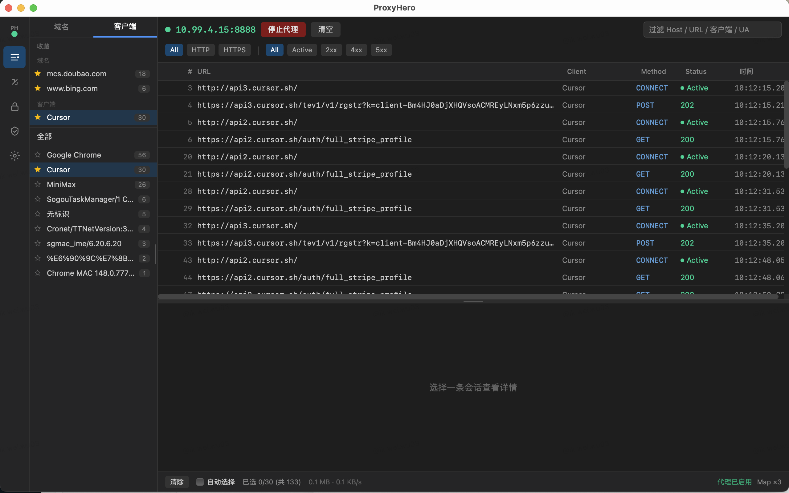

[English](README.md) | [中文](README_CN.md)

# ProxyHero

本地 **MITM 抓包桌面工具**，对标 Proxyman / Charles。支持 HTTPS 解密、Map Remote/Local、SSL 规则、根证书安装与系统代理，内置常用联调预设。



## 为什么做 ProxyHero

前端和 App 工程师在联调接口时，经常需要查看真实请求与响应、把流量切到本地或测试环境、或在真机上抓 HTTPS。通用抓包工具能用，但团队日常更需要一款面向联调的桌面工具：Map 规则、内置预设、局域网联调等能力开箱即用。

ProxyHero 就是为这个场景做的 —— 给 **Web / App 工程师做本地接口联调**，不只能依赖后端日志排查问题。

Charles、Proxyman 等收费软件功能虽多，但日常联调往往只需要抓包、改路由、真机调试这几项。**免费、轻量**的工具更好上手：没有授权门槛，也不被用不到的高级功能干扰，打开就能用。

## 功能

| 模块 | 说明 |
|------|------|
| **Traffic** | 会话列表（虚拟滚动）、域名/客户端侧栏筛选、底部 Inspector、cURL 复制 |
| **Map Rules** | Map Remote（改写上游）、Map Local（本地文件响应）、内置预设一键导入 |
| **SSL** | Include / Exclude 控制是否 MITM |
| **Certificate** | 生成/安装根 CA、钥匙串指纹与信任诊断 |
| **Settings** | 代理端口、系统代理开关、局域网联调说明 |

代理默认监听 **`0.0.0.0:8888`**，本机与同一局域网设备均可连接。

## 技术栈

- **UI**：React 19 + TypeScript + Vite + Tailwind CSS 4 + Zustand
- **桌面壳**：Tauri 2
- **代理核心**：Rust + [hudsucker](https://github.com/omjadas/hudsucker)（MITM）
- **证书**：rcgen 动态签发站点证书；IP 访问使用 `SanType::IpAddress`

## 环境要求

- **Node.js** 18+（推荐 pnpm）
- **Rust** 1.88+（见 `rust-toolchain.toml`）
- **macOS**：系统代理、根证书安装与绕过列表处理已适配；Windows / Linux 证书与系统代理能力以当前代码为准

## 快速开始

```bash
cd proxyhero
pnpm install
pnpm tauri dev
```

生产构建：

```bash
pnpm tauri build
```

仅构建前端或 Rust 核心：

```bash
pnpm build
cargo build -p proxy-core
cargo test -p proxy-core
```

## 使用流程（联调）

### 本机使用

1. 打开 **Traffic** 或 **Settings**，点击「启动代理」（同时启动 MITM 服务并开启系统代理；macOS 会自动取消内网 IP 绕过）。
2. **Certificate**：生成并安装根 CA（**ProxyHero CA**），确认诊断页指纹一致。
3. **Map Rules**：按需应用内置预设或自定义规则。
4. 在浏览器 / App 中访问目标站，回到 **Traffic** 查看明文请求与响应。

### 手机抓包

1. 确保手机与电脑在同一局域网。
2. 在 **Settings** 查看电脑的局域网 IP 地址（如 `192.168.x.x`）。
3. 在手机 Wi-Fi 设置中配置代理：服务器设为电脑 IP，端口设为 `8888`。
4. 在手机浏览器访问 `http://proxyhero/ca` 或 `http://{电脑IP}:8888/ca` 下载并安装根证书。
5. **iOS**：设置 → 通用 → VPN 与设备管理 → 安装证书 → 通用 → 关于本机 → 证书信任设置 → 开启 **ProxyHero CA**。
6. **Android**：设置 → 安全 → 从存储设备安装 → 选择下载的证书 → 设置为「VPN 和应用」。
7. 在手机上访问目标应用，电脑 **Traffic** 页面即可查看请求。

### 常见问题

若 HTTPS 报 `NET::ERR_CERT_AUTHORITY_INVALID`：删除钥匙串中旧的根 CA（含旧版 **LK Debug Proxy CA**）→ 在 Certificate 页重新生成并安装 → 重启代理与浏览器。

## 项目结构

```text
proxyhero/                  # 源码目录
├── src/                    # React 前端
├── src-tauri/              # Tauri 命令、证书、系统代理
└── crates/proxy-core/      # hudsucker 代理、抓包、规则引擎
```

持久化目录（应用数据）：

- `config.json` — 端口、系统代理状态等
- `rules.json` — Map / SSL 规则
- `certs/proxyhero-ca.crt` — 根 CA 与私钥

## 架构说明

- [架构与抓包原理（中文）](docs/architecture-and-capture_zh.md)

## 限制

- 须信任 **ProxyHero CA** 才能解密 HTTPS；Certificate Pinning 的客户端无法 MITM。
- 仅抓取经代理转发的流量；devServer 服务端转发段不经过浏览器代理。
- HTTP/2 多路复用下同连接 FIFO 关联请求/响应，极高并发下可能错配。
- 本工具用于本地联调，不替代业务网关或后端的鉴权能力。
