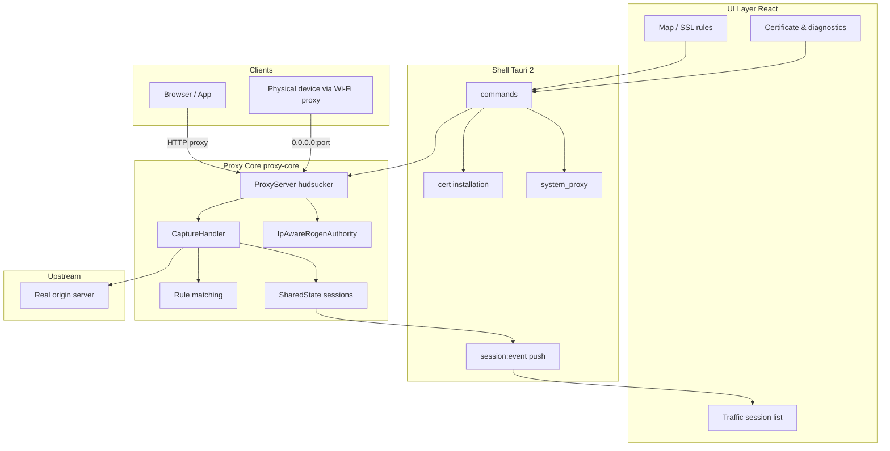
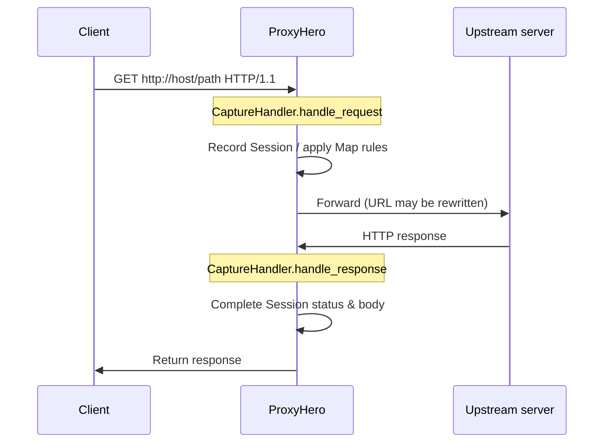
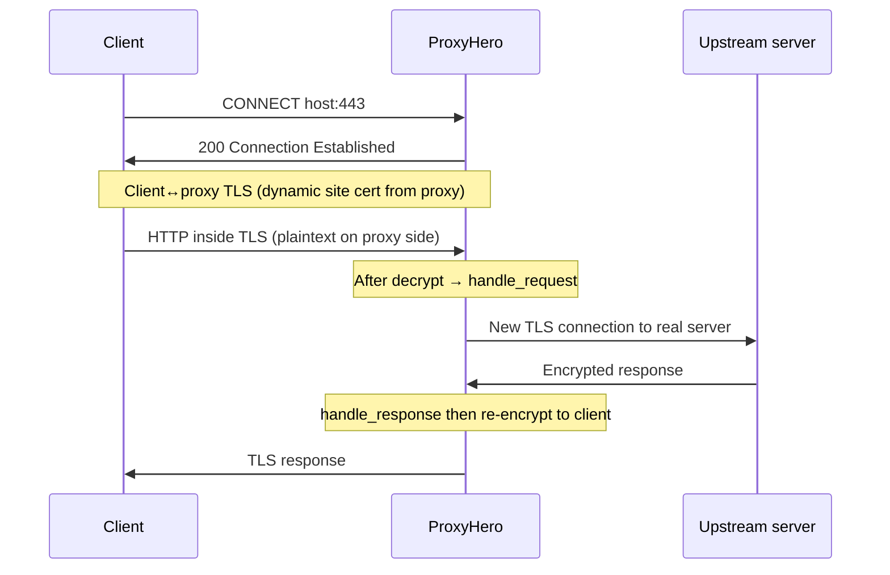

[English](architecture-and-capture.md) | [中文](architecture-and-capture_zh.md)

# ProxyHero (proxyhero) Architecture & Capture

A local MITM capture desktop tool for frontend / app / backend integration debugging. Product codename: **proxyhero**.

## 1. Overall Architecture



| Layer | Directory | Responsibility |
| --- | --- | --- |
| UI | `src/` | Session display, rule configuration, certificate & settings |
| Shell | `src-tauri/` | Process lifecycle, system proxy / cert install, IPC |
| Core | `crates/proxy-core/` | MITM proxy, capture, rule rewriting |
| Persistence | `{app_data}/` | `config.json`, `rules.json`, `certs/` |

Listens on `0.0.0.0:{port}` by default (8888). Accessible from localhost and LAN devices.

## 2. Capture Principles (MITM)

### 2.1 vs. Plain Forwarding Proxy

| Mode | Behavior | HTTPS plaintext visible? |
| --- | --- | --- |
| Forwarding proxy | Forwards TCP/TLS as-is | No |
| **MITM proxy (this tool)** | Terminates TLS on both sides and decrypts in the middle | Yes (root CA must be trusted) |

Built on [hudsucker](https://github.com/omjadas/hudsucker) for HTTP/HTTPS MITM. Runs in-process with Tauri in Rust — no Node sidecar.

### 2.2 HTTP Capture Flow



1. Client uses proxy `127.0.0.1:8888` (or system proxy pointing to it).
2. On full HTTP request, `CaptureHandler` decodes body (max 1MB) and writes `Session`.
3. Rewrite per rules or return local file directly (Map Local).
4. Forward to upstream; on response, record and push to UI.

### 2.3 HTTPS Capture Flow (Core)



Key points:

- **Root CA** (`ProxyHero CA`) generated by `load_or_create_ca`, stored at `{app_data}/certs/proxyhero-ca.crt`.
- Per host/IP, **IpAwareRcgenAuthority** issues dynamic site certs (`SanType::IpAddress` for IPs, `DnsType` for domains).
- Browser accepts site cert only when **root CA is trusted**; otherwise `NET::ERR_CERT_AUTHORITY_INVALID`.
- Root install must include SSL trust (macOS: `security add-trusted-cert -p ssl`); proxy CA must match keychain.

### 2.4 Session Correlation & Push

- Each request gets a `session_id` (UUID).
- Request/response on same TCP connection correlated via FIFO per `client_addr` (HTTP/1.1 ordering; simplified for HTTP/2 multiplexing).
- `SharedState` broadcasts `SessionEvent` (Created / Updated / Completed) via `tokio::sync::broadcast`.
- Tauri `spawn_session_listener` forwards as `session:event`; React incrementally updates the list.

## 3. Rule Engine

Rules apply in order in `handle_request` (see `crates/proxy-core/src/handler.rs`).

| Type | Config | Behavior |
| --- | --- | --- |
| **Map Local** | `rules.json` → `mapLocal` | On match, read local file and return without upstream |
| **Map Remote** | `mapRemote` | Rewrite `Uri` scheme/host/port then forward (e.g. `api.example.com` → `127.0.0.1:8080`) |
| **SSL** | `ssl.mode` + include/exclude | Control MITM; Exclude list marks `sslTunnel` (skip decrypt semantics) |

Matching (`matcher.rs`):

- Host: exact / `*.suffix` / glob
- Path: glob (including `**`)
- Map Remote target host allowlist: IP literals, `localhost`, etc. — SSRF protection (extend via `allowedMapHosts`)

Built-in presets (`rules.rs` → `builtin_presets`): e.g. local API 8080, local dev server 3000.

## 4. Certificate Module

| File | Description |
| --- | --- |
| `proxy-core/src/server.rs` | Generate/load CA, start `IpAwareRcgenAuthority` |
| `proxy-core/src/ca.rs` | Site cert issuance (IP SAN fix) |
| `src-tauri/src/cert.rs` | Install, fingerprint diagnostics, detect legacy 1975–4096 CA |

CA requirements: validity from now + 10 years; `KeyCertSign` / `CrlSign`. Legacy rcgen default 1975–4096 CA is auto-rebuilt on startup.

## 5. System Proxy

When enabling system proxy, `system_proxy.rs`:

1. Sets HTTP/HTTPS proxy to `127.0.0.1:{port}`.
2. **Clears intranet bypass entries on macOS** (`192.168.0.0/16`, `10.0.0.0/8`, etc.) — otherwise IP traffic skips proxy.
3. Restores bypass list and proxy toggle when disabling or quitting.

Without system/browser proxy configured, traffic does not reach the capture port even if the proxy service is running.

## 6. Frontend & IPC

| Tauri Command | Purpose |
| --- | --- |
| `start_proxy` / `stop_proxy` | Start/stop hudsucker |
| `list_sessions` / `get_session` | Query sessions |
| `get_rules` / `save_rules_cmd` | Rule CRUD |
| `install_ca` / `get_cert_diagnostic` | Certificate & trust diagnostics |
| `set_system_proxy` | System proxy toggle |

Events: `session:event` → frontend `onSessionEvent` updates Zustand store.

## 7. Data Model (Session)

```text
Session
├── id, method, url, host, path, scheme
├── status, durationMs, requestSize, responseSize
├── request / response (HttpMessage: headers, body, isBinary)
├── mappedRuleId, mapType (local | remote)
└── sslTunnel, completed
```

Body policy: text as UTF-8; binary as base64; per-message cap `MAX_BODY_BYTES` (1MB); ring eviction for sessions (default max 10,000).

## 8. Integration Workflow

```text
1. Start proxy (Traffic)
2. Certificate: generate & install root CA → trust diagnostics fingerprints match
3. Settings: enable system proxy (needed for IP/intranet capture)
4. Rules: apply built-in presets or custom Map Remote as needed
5. Visit target in browser → view plaintext in Traffic
```

## 9. Limitations & Notes

- **Root CA must be trusted** for HTTPS decrypt; corporate devices may block user CAs.
- **Certificate Pinning** apps/WebViews cannot be MITM'd — use Exclude or skip proxy.
- **Dev server server-side proxy** (e.g. devServer proxy) does not go through browser proxy — that segment is not captured.
- **HTTP/2 multiplexing**: request/response pairing is FIFO per connection; may mismatch under extreme concurrency.
- Captures only local / proxied traffic; does not replace business gateway or backend auth.

## 10. Code Index

| Topic | Path |
| --- | --- |
| Proxy start/stop | `crates/proxy-core/src/server.rs` |
| Capture & rewrite | `crates/proxy-core/src/handler.rs` |
| Dynamic certs | `crates/proxy-core/src/ca.rs` |
| Rules & presets | `crates/proxy-core/src/rules.rs` |
| Tauri entry | `src-tauri/src/lib.rs` |
| Cert install | `src-tauri/src/cert.rs` |
| System proxy | `src-tauri/src/system_proxy.rs` |
