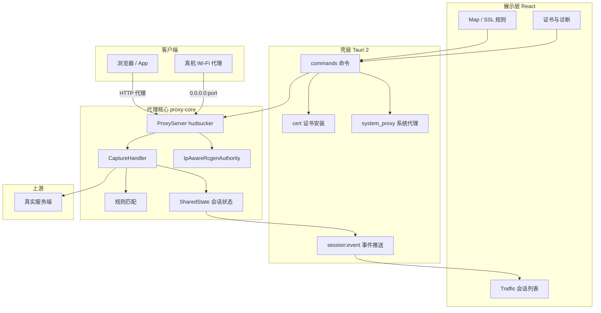
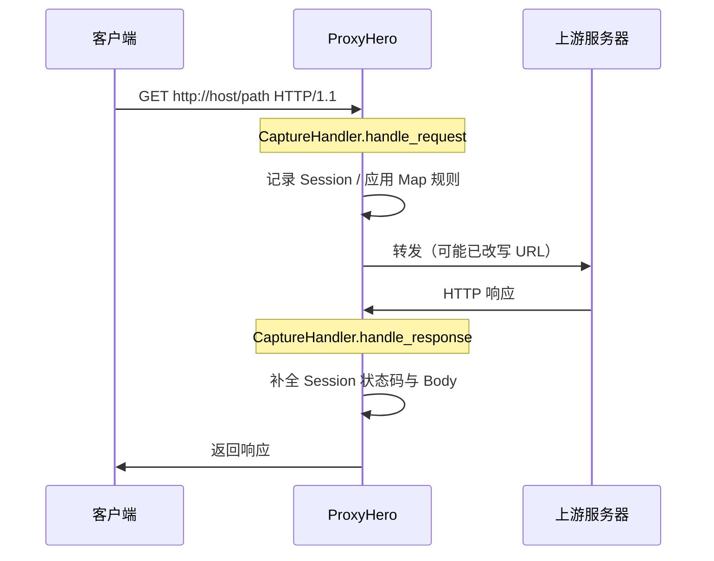
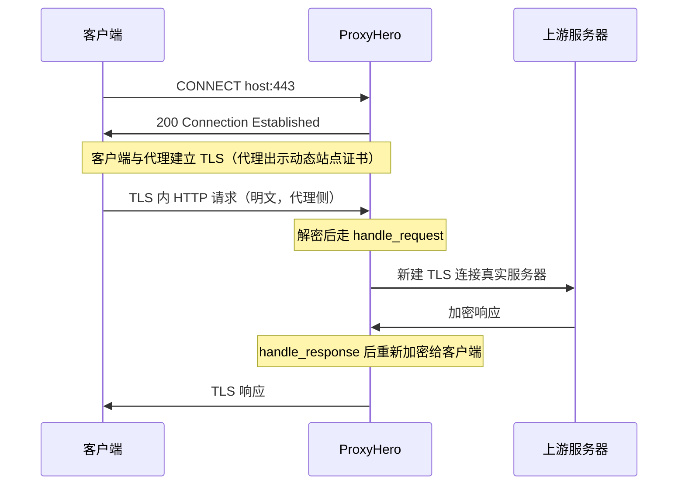

# ProxyHero（proxyhero）架构与抓包原理

[English](architecture-and-capture.md) | [中文](architecture-and-capture_zh.md)

面向前端 / App / 后端联调的本地 MITM 抓包桌面工具，产品代号 **proxyhero**。

## 1. 总体架构



| 层级 | 目录 | 职责 |
| --- | --- | --- |
| UI | `src/` | 会话展示、规则配置、证书与设置 |
| 壳 | `src-tauri/` | 进程生命周期、系统代理/装证、IPC |
| 核心 | `crates/proxy-core/` | MITM 代理、抓包、规则改写 |
| 持久化 | `{app_data}/` | `config.json`、`rules.json`、`certs/` |

默认监听 `0.0.0.0:{port}`（默认 8888），本机与局域网设备均可连接。

## 2. 抓包原理（MITM）

### 2.1 与普通代理的区别

| 模式 | 行为 | 能否看 HTTPS 明文 |
| --- | --- | --- |
| 转发代理 | 原样转发 TCP/TLS | 否 |
| **MITM 代理（本工具）** | 代客户端与服务器分别建 TLS，中间解密 | 是（需信任根证书） |

本工具基于 [hudsucker](https://github.com/omjadas/hudsucker) 实现 HTTP/HTTPS MITM，在 Rust 内与 Tauri 同进程运行，无 Node sidecar。

### 2.2 HTTP 抓包流程



1. 客户端将代理设为 `127.0.0.1:8888`（或系统代理指向该地址）。
2. 代理收到完整 HTTP 请求后，`CaptureHandler` 解码 Body（上限 1MB），写入 `Session`。
3. 按规则改写请求或直接返回本地文件（Map Local）。
4. 转发至上游，收到响应后同样记录并推送 UI。

### 2.3 HTTPS 抓包流程（核心）



要点：

- **根 CA**（`ProxyHero CA`）由 `load_or_create_ca` 生成，存于 `{app_data}/certs/proxyhero-ca.crt`。
- 对每个访问域名/IP，**IpAwareRcgenAuthority** 动态签发站点证书（IP 使用 `SanType::IpAddress`，域名使用 `DnsType`）。
- 浏览器仅当**已信任根 CA** 时，才认为站点证书合法；否则报 `NET::ERR_CERT_AUTHORITY_INVALID`。
- 安装根证书须带 SSL 信任（macOS：`security add-trusted-cert -p ssl`），且代理使用的 CA 与钥匙串中一致。

### 2.4 会话关联与推送

- 每个请求生成 `session_id`（UUID）。
- 同一 TCP 连接上请求/响应按 `client_addr` 做 FIFO 队列关联（HTTP/1.1 保序；HTTP/2 多路复用场景为简化实现）。
- `SharedState` 通过 `tokio::sync::broadcast` 发送 `SessionEvent`（Created / Updated / Completed）。
- Tauri `spawn_session_listener` 转为 `session:event` 推送到前端，React 增量更新列表。

## 3. 规则引擎

规则在 `handle_request` 中按序生效（见 `crates/proxy-core/src/handler.rs`）。

| 类型 | 配置 | 行为 |
| --- | --- | --- |
| **Map Local** | `rules.json` → `mapLocal` | 命中则读本地文件直接返回，不访问上游 |
| **Map Remote** | `mapRemote` | 改写 `Uri` 的 scheme/host/port，再转发（如 `api.example.com` → `127.0.0.1:8080`） |
| **SSL** | `ssl.mode` + include/exclude | 控制是否 MITM；Exclude 列表内标记 `sslTunnel`（语义上跳过解密策略） |

匹配逻辑（`matcher.rs`）：

- Host：精确 / `*.suffix` / glob
- Path：glob（含 `**`）
- Map Remote 目标 host 白名单：IP 字面量、`localhost` 等，防 SSRF（可在 `allowedMapHosts` 中扩展）

内置预设（`rules.rs` → `builtin_presets`）：如本地 API 8080、本地开发服务 3000。

## 4. 证书模块

| 文件 | 说明 |
| --- | --- |
| `proxy-core/src/server.rs` | 生成/加载 CA，启动 `IpAwareRcgenAuthority` |
| `proxy-core/src/ca.rs` | 站点证书签发（修复 IP SAN） |
| `src-tauri/src/cert.rs` | 装证、指纹诊断、检测 1975–4096 旧版 CA |

CA 要求：有效期为「当前起 10 年」，具备 `KeyCertSign` / `CrlSign`。旧版 rcgen 默认 1975–4096 的 CA 会在启动时自动重建。

## 5. 系统代理

`system_proxy.rs` 在启用系统代理时：

1. 设置 HTTP/HTTPS 代理为 `127.0.0.1:{port}`。
2. **清除 macOS 代理绕过列表**中的内网网段（`192.168.0.0/16`、`10.0.0.0/8` 等），否则 IP 访问不走代理。
3. 关闭代理或退出应用时恢复绕过列表与代理开关。

仅「启动代理」而不配置系统/浏览器代理时，流量不会进入抓包端口。

## 6. 前端与 IPC

| Tauri Command | 作用 |
| --- | --- |
| `start_proxy` / `stop_proxy` | 启停 hudsucker |
| `list_sessions` / `get_session` | 查询会话 |
| `get_rules` / `save_rules_cmd` | 规则 CRUD |
| `install_ca` / `get_cert_diagnostic` | 证书与信任诊断 |
| `set_system_proxy` | 系统代理开关 |

事件：`session:event` → 前端 `onSessionEvent` 更新 Zustand store。

## 7. 数据模型（Session）

```text
Session
├── id, method, url, host, path, scheme
├── status, durationMs, requestSize, responseSize
├── request / response (HttpMessage: headers, body, isBinary)
├── mappedRuleId, mapType (local | remote)
└── sslTunnel, completed
```

Body 策略：文本 UTF-8 存储；二进制转 base64；单条上限 `MAX_BODY_BYTES`（1MB）；会话总数环形淘汰（默认最多 10000 条）。

## 8. 使用链路（联调）

```text
1. 启动代理（Traffic）
2. Certificate：生成并安装根 CA → 信任诊断指纹一致
3. Settings：启用系统代理（需抓 IP/内网时）
4. Rules：按需应用内置预设或自定义 Map Remote
5. 浏览器访问目标站 → Traffic 查看明文
```

## 9. 限制与注意

- **必须信任根 CA** 才能解密 HTTPS；企业设备可能禁止用户 CA。
- **Certificate Pinning** 的 App/WebView 无法 MITM，需 Exclude 或不用代理。
- **开发服务器服务端转发**（如 devServer proxy）不经过浏览器代理，抓不到那一段。
- **HTTP/2 多路复用** 下请求/响应关联为同连接 FIFO，极端并发可能错配。
- 抓包仅限本机/经代理转发的流量，不替代业务网关或后端的鉴权能力。

## 10. 相关代码索引

| 主题 | 路径 |
| --- | --- |
| 代理启停 | `crates/proxy-core/src/server.rs` |
| 抓包与改写 | `crates/proxy-core/src/handler.rs` |
| 动态证书 | `crates/proxy-core/src/ca.rs` |
| 规则与预设 | `crates/proxy-core/src/rules.rs` |
| Tauri 入口 | `src-tauri/src/lib.rs` |
| 证书安装 | `src-tauri/src/cert.rs` |
| 系统代理 | `src-tauri/src/system_proxy.rs` |
